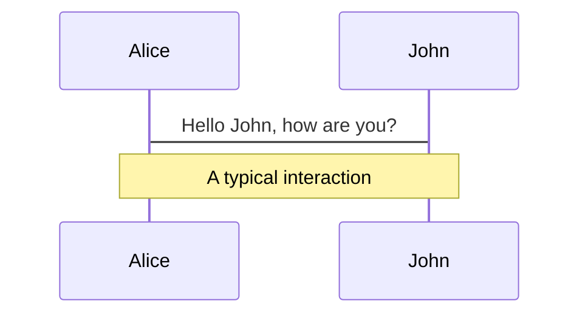
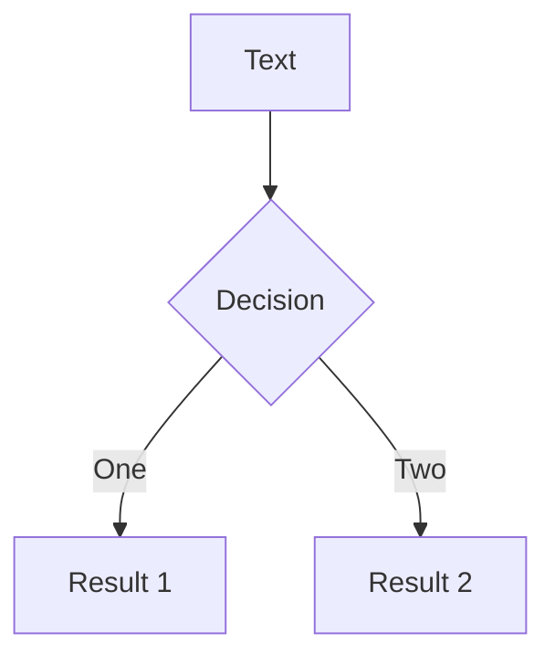
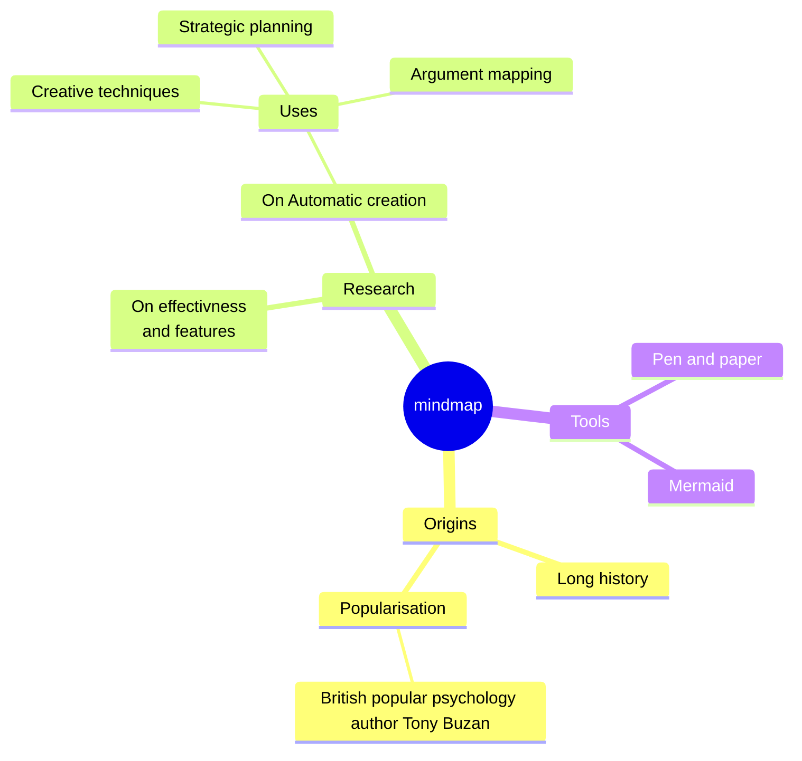
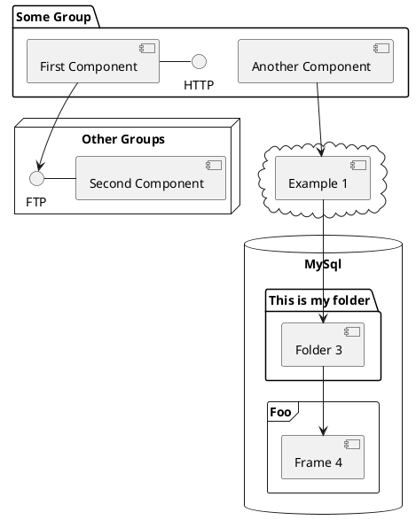

# Benchmark Rusty Parsers

Demystify Native Tooling Performance in JavaScript

<div class="pt-12">
  <span @click="$slidev.nav.next" class="px-2 py-1 rounded cursor-pointer" hover="bg-white bg-opacity-10">
    Press Space for next page <carbon:arrow-right class="inline"/>
  </span>
</div>

<div class="abs-br m-6 flex gap-2">
  <button @click="$slidev.nav.openInEditor()" title="Open in Editor" class="text-xl slidev-icon-btn opacity-50 !border-none !hover:text-white">
    <carbon:edit />
  </button>
  <a href="https://github.com/slidevjs/slidev" target="_blank" alt="GitHub" title="Open in GitHub"
    class="text-xl slidev-icon-btn opacity-50 !border-none !hover:text-white">
    <carbon-logo-github />
  </a>
</div>

<!--
The last comment block of each slide will be treated as slide notes. It will be visible and editable in Presenter Mode along with the slide. [Read more in the docs](https://sli.dev/guide/syntax.html#notes)
-->

---
transition: fade
layout: image
image: /splash-white.png
---

---
transition: fade
layout: image
image: /splash.png
---

---
transition: fade-out
---

# Rust in JavaScript

**Rust** is rapidly becoming a language of choice within the JavaScript ecosystem

- **Rspack** - Webpack
- **Biome** - Prettier/Eslint
- **Swc** - Babel
- **Oxc** - Babel/Eslint
- **Lightening CSS** - PostCSS
- **Rolldown** - Rollup
- **Turbopack** - For Next.js

<style>
h1 {
  background-color: #2B90B6;
  background-image: linear-gradient(45deg, #4EC5D4 10%, #146b8c 20%);
  background-size: 100%;
  -webkit-background-clip: text;
  -moz-background-clip: text;
  -webkit-text-fill-color: transparent;
  -moz-text-fill-color: transparent;
}
</style>

<!--
Here is another comment.
-->

---
layout: default
---

# Why Rust?

<v-clicks fade>

- ### Peak Performance
  - Better Compiler Optimization
  - Compact Data Layout: less cache miss / fewer instructions
  - Multiple Threads
  - Powerful Hardware Intrinsics, e.g. SIMD
- ### Predictable Performance
  - No Garbage Collection
  - No JIT deoptimization
- ### Ecosystem
  - cargo toolchain is amazing
  - napi.rs is goat

</v-clicks>

---
transition: slide-up
level: 2
---

# Why Not Rust Plugins?

<div grid="~ cols-2 gap-4">
<div>

Designing an efficient and portable plugin system.

<v-clicks fade>

- ## Learning Curve
  - Lifetime
  - Borrow Checker
  - Unsafe Rust

- ## Distribute Plugins is Hard
  - Either statically compile all plugins in binary
  - Or design stable application binary interface

- ## Fewer External Contributions

</v-clicks>

</div>

<div>
    <Tweet v-click id="1726663311541100626"/>
</div>

</div>

---
layout: image-right
image: /ast.jpg
---

# So we need JS API!


* ### Plugin system is beyond the scope of this talk.

* ### We'll concentrate on how to write Rust tooling plugins in JavaScript.

* ### One critical part of FE tooling is parsing code into Abstract Syntax Tree (AST)

---

# NAPI-rs Pros & Cons

We need to use binding to call Rust from JavaScript. napi-rs is our first choice :).

- ## Pros
  - All performance gain from Rust!
  - Easy to use high-level API
  - Amazing tooling support
- ## Cross Language Interop
  - Foreign Function Call is expensive
  - Serialization/Deserialization
  - String Encoding convert utf-16 to utf-8


---

# Choosing Parsers

We focus on **TypeScript** parsers in this talk.

- **[ast-grep](https://ast-grep.github.io/)**: A tool[^1] for structural search, lint, and rewriting based on AST, using its [napi binding](https://github.com/ast-grep/ast-grep/tree/main/crates/napi).
- **[Tree-sitter](https://tree-sitter.github.io)**: An incremental parsing library that can build and update concrete syntax trees.

<br/>

- **[swc](https://swc.rs/)**: A super-fast TS/JS compiler written in Rust, performant and usable in both RS and JS.
- **[oxc](https://oxc-project.github.io/)**: A suite of high-performance tools for JS/TS, maybe the fastest parser.

<br/>

- **[Babel](https://babeljs.io/)**: The Babel parser (previously Babylon) is a JavaScript parser used in Babel compiler.
- **[TypeScript](https://www.typescriptlang.org/)**: The official parser implementation from the TypeScript team.

<br/>
<br/>

[^1]: Disclaimer: Presenter is ast-grep's [author](https://github.com/HerringtonDarkholme)


---

# Benchmark Design

We consider two main factors

<v-click>

- **File Size**
  - Different file sizes reveal distinct performance characteristics.

- **Concurrency Level**
  - JavaScript is single threaded. Native parsers can run in separate threads

<br/>
</v-click>

<v-click>

***

<p class="opacity-50">We are not considering these factors</p>

- **Warmup and JIT:** No significant difference observed
- **GC, Memory Usage:** Not typical bottleneck in parsing
- **Node.js parameter:** default Node.js arguments were used

</v-click>


---

# File Size Categories

To assess parser performance across a variety of codebases

- **Single Line:**
  - A one-line snippet, `let a = 123;`, to measure baseline overhead.
- **Small File:**
  - A concise 24-line module, representing a common utility file.
- **Medium File:**
  - A typical 400-line file, reflecting average development workloads.
- **Large File:**
  - The glorious `checker.ts` from the TypeScript repository.


---

# Concurrency Level

More cores, more power.

* We simulate workload by **parsing five files concurrently**.

* This number is an arbitrary but reasonable proxy to the actual JavaScript tooling.

* This benchmark is a general overview to reveal the performance characteristics.

* Feel free to adjust the benchmark setup to better fit your workload. :)


---

# Results

Raw data can be found in this [Google Sheet](https://docs.google.com/spreadsheets/d/1oIRXDaJ-EnjKz8GKpmUjVwh_FNw4Nsf6mbA0QPCiTh0/edit#gid=0).

<v-clicks fade>

* Perf Measurement
    * data are collected Benny benchmarking framework
    * performance is calcuated as operations per second

* Normalized Comparison
    * The fastest parser is designated as the benchmark, set at 100% efficiency.
    * Other parsers are evaluated relatively, as a percentage of the fastest parser’s speed.

* Two types of benchmarks
    * Synchronous Parsing
    * Asynchronous Parsing

</v-clicks>

---
layout: center
---

# Sync Parse

Perf Chart


---

# Sync Parse

Perf Table


* TypeScript consistently outperforms the competition
* Native parsers show improved performance for larger files
* Babel demonstrates unstable performance

---
layout: center
---

# Async Parse

Perf Chart


---

# Async Parse


* ast-grep excels when handling multiple medium to large files concurrently
* TypeScript and Tree-sitter experience a decline in performance with larger files
* SWC and Oxc maintain consistent performance


---

# Parse Time Breakdown

NAPI time can be dissected into three main components

$$
\textit{time} = \textit{ffi\_time} + \textit{parse\_time} + \textit{serde\_time}
$$


- Foreign Function Interface: A fixed cost to invoke functions across different languages

- Parse: a variable cost that scales with the size of the input

- Serialization/Deserialization: convert Rust data into a JS-compatible format. It may be a fixed or variable cost, depending on the implementation

<!--
In essence, benchmarking a parser involves measuring the time for the actual parsing (`parse_time`) and accounting for the extra overhead from cross-language function calls (`ffi_time`) and data format conversion (`serde_time`).

Understanding these elements helps us evaluate the efficiency and scalability of the parser in question.
-->

---

# Result Interpretation

We will interpret the results in the following order

* FFI Overhead
* Serde Overhead
* Parallel Parsing

---
layout: two-cols
clicks: 3
---

# FFI Overhead

<br/>

<v-clicks>

* "one line" stands for the baseline FFI overhead
  * minimal parse/serde time
* FFI is less significant as file size grows
  * it's largely size-independent
  * ast-grep's perf increased from 72% to 78%
  * suggesting a rough 6% FFI overhead
* FFI is more pronounced in async parsing
  * ast-grep’s one-line perf: 72% sync vs 60% async
  * swc/oxc may have [unique implementation](https://github.com/oxc-project/oxc/blob/2d5e0d5d0775300463f36b925e2f1ce71f119b90/napi/parser/src/lib.rs#L96).

</v-clicks>

::right::

<arrow v-click="[1, 2]" x1="170" y1="10" x2="170" y2="60" color="#564" width="2" arrowSize="1" />
<arrow v-click="[1, 2]" x1="170" y1="420" x2="170" y2="370" color="#564" width="2" arrowSize="1" />

<arrow v-click="[2, 3]" x1="270" y1="10" x2="170" y2="60" color="#564" width="2" arrowSize="1" />
<arrow v-click="[2, 3]" x1="300" y1="10" x2="400" y2="60" color="#564" width="2" arrowSize="1" />

<arrow v-click="[3, 4]" x1="230" y1="180" x2="180" y2="90" color="#564" width="2" arrowSize="1" />
<arrow v-click="[3, 4]" x1="230" y1="370" x2="180" y2="280" color="#564" width="2" arrowSize="1" />

<br/>


<br/>


---
layout: two-cols
---

# Serde Overhead

Unfortunately, we failed to replicate swc/oxc's blazing performance we witnessed in other applications.

* swc/oxc is slower than TSC
  * Caused by calling [`JSON.parse` on strings](https://github.com/swc-project/swc/blob/5d944185187402691292fdb73ea767bd580e2a52/node-swc/src/index.ts#L108)
  * Sending RS data is even slower than JSON
* Tree-sitter/ast-grep avoid serde overhead
  * By [returning a tree object](https://github.com/ast-grep/ast-grep/blob/1c3accfd7dccef293c480951759b86c418cde977/crates/napi/src/sg_node.rs#L297)
  * Tree nodes access requires [invoking Rust methods](https://github.com/ast-grep/ast-grep/blob/1c3accfd7dccef293c480951759b86c418cde977/crates/napi/src/sg_node.rs#L78) from JS
  * _Distribute the cost over reading_

::right::

SWC's JSON parse
```ts {3-5}
parseSync(src, options, filename) {
  ...
  if (bindings) {
    return JSON.parse(
      bindings.parseSync(src, toBuffer(options), filename)
    );
  } else { ... }
}
```

ast-grep's tree
```rs
#[napi]
impl SgRoot { ... } // in Rust
```
```ts
export class SgNode { // in JS
  text(): string
  parent(): SgNode | null
  children(): SgNode[]
}
// serde cost is amortized across reads
```

---

# Parallel

Except tree-sitter, all native TS parsers have parallel support. Contrary to JS parsers, native parsers performance will not degrade when concurrently parsing larger files. This is thanks to the power of multiple cores. JS parsers suffer from CPU bound because they have to parse file one by one.

---
layout: image-right
image: https://source.unsplash.com/collection/94734566/1920x1080
---

# Code

Use code snippets and get the highlighting directly![^1]

```ts {all|2|1-6|9|all}
interface User {
  id: number
  firstName: string
  lastName: string
  role: string
}

function updateUser(id: number, update: User) {
  const user = getUser(id)
  const newUser = { ...user, ...update }
  saveUser(id, newUser)
}
```

<arrow v-click="[3, 4]" x1="400" y1="420" x2="230" y2="330" color="#564" width="3" arrowSize="1" />

[^1]: [Learn More](https://sli.dev/guide/syntax.html#line-highlighting)

<style>
.footnotes-sep {
  @apply mt-20 opacity-10;
}
.footnotes {
  @apply text-sm opacity-75;
}
.footnote-backref {
  display: none;
}
</style>

<!--
Presenter note with **bold**, *italic*, and ~~striked~~ text.

Also, HTML elements are valid:
<div class="flex w-full">
  <span style="flex-grow: 1;">Left content</span>
  <span>Right content</span>
</div>
-->


---
preload: false
---

# Animations

Animations are powered by [@vueuse/motion](https://motion.vueuse.org/).

```html
<div
  v-motion
  :initial="{ x: -80 }"
  :enter="{ x: 0 }">
  Slidev
</div>
```

<div class="w-60 relative mt-6">
  <div class="relative w-40 h-40">
    
    
    
  </div>

  <div
    class="text-5xl absolute top-14 left-40 text-[#2B90B6] -z-1"
    v-motion
    :initial="{ x: -80, opacity: 0}"
    :enter="{ x: 0, opacity: 1, transition: { delay: 2000, duration: 1000 } }">
    Slidev
  </div>
</div>

<!-- vue script setup scripts can be directly used in markdown, and will only affects current page -->
<script setup lang="ts">
const final = {
  x: 0,
  y: 0,
  rotate: 0,
  scale: 1,
  transition: {
    type: 'spring',
    damping: 10,
    stiffness: 20,
    mass: 2
  }
}
</script>

<div
  v-motion
  :initial="{ x:35, y: 40, opacity: 0}"
  :enter="{ y: 0, opacity: 1, transition: { delay: 3500 } }">

[Learn More](https://sli.dev/guide/animations.html#motion)

</div>

---

# LaTeX

LaTeX is supported out-of-box powered by [KaTeX](https://katex.org/).

<br>

Inline $\sqrt{3x-1}+(1+x)^2$

Block
$$ {1|3|all}
\begin{array}{c}

\nabla \times \vec{\mathbf{B}} -\, \frac1c\, \frac{\partial\vec{\mathbf{E}}}{\partial t} &
= \frac{4\pi}{c}\vec{\mathbf{j}}    \nabla \cdot \vec{\mathbf{E}} & = 4 \pi \rho \\

\nabla \times \vec{\mathbf{E}}\, +\, \frac1c\, \frac{\partial\vec{\mathbf{B}}}{\partial t} & = \vec{\mathbf{0}} \\

\nabla \cdot \vec{\mathbf{B}} & = 0

\end{array}
$$

<br>

[Learn more](https://sli.dev/guide/syntax#latex)

---

# Diagrams

You can create diagrams / graphs from textual descriptions, directly in your Markdown.

<div class="grid grid-cols-4 gap-5 pt-4 -mb-6">









</div>

[Learn More](https://sli.dev/guide/syntax.html#diagrams)

---
src: ./pages/multiple-entries.md
hide: false
---

---
layout: center
class: text-center
---

# Learn More

[Documentations](https://sli.dev) · [GitHub](https://github.com/slidevjs/slidev) · [Showcases](https://sli.dev/showcases.html)
